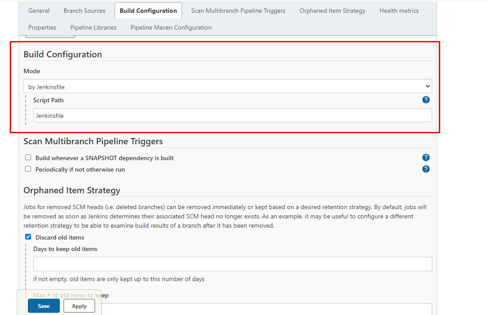
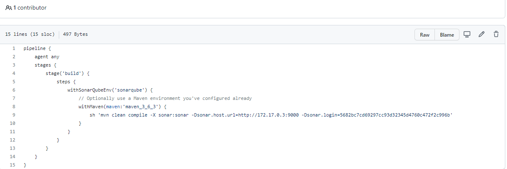
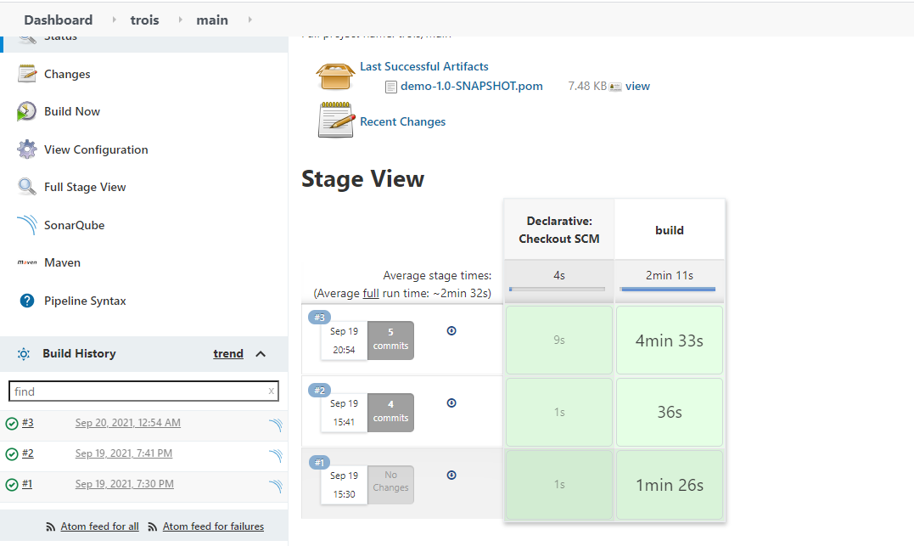
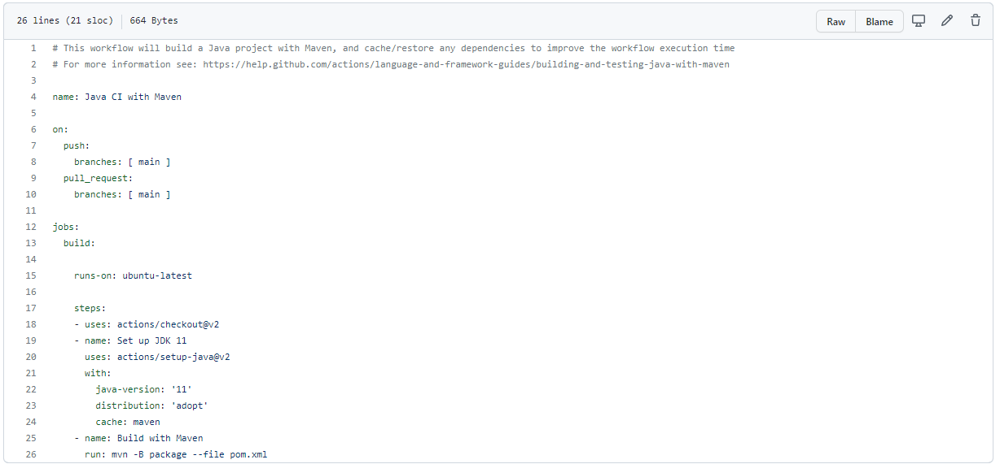

# Description du projet

Une longue créature serpentine se faufile dans un champ limité, obéissant aux ordres du joueur (déplacement à droite, à gauche, en bas et en haut). Et il n'y a aucun moyen de l'empêcher de bouger. Mais ne touchez pas les limites ou vous mourrez ! Et ne vous mordez pas ou... bon, vous voyez le genre. En cours de route, la créature rencontre de la nourriture qui l'allonge encore plus. Au fur et à mesure qu'elle grandit, elle est de plus en plus à l'étroit... Arrêtez la folie !

Tiré de codegym (2021).Hungry Snake - CodeGym. repéré à https://codegym.cc/projects/games/com.codegym.games.snake

# Diagramme de classe


# Intégration continue avec jenkins - sonarqube

Un prérequis de ce travail a été d'avoir déjà docker installé sur notre machine.

## 1- Installer et deployer jenkins
```
docker run -p 8080:8080 -p 50000:50000 -v jenkins_home:/var/jenkins_home jenkins/jenkins:lts
```
Ceci créera automatiquement un volume docker "jenkins_home" sur la machine hôte. Les volumes Docker conservent leur contenu même lorsque le conteneur est arrêté, démarré ou supprimé. Ceci va aussi stocker l'espace de travail dans /var/jenkins_home. Toutes les données de Jenkins s'y trouvent, y compris les plugins et la configuration. Vous voudrez probablement en faire un volume explicite afin de pouvoir le gérer et l'attacher à un autre conteneur pour les mises à jour :

## 2- Créer les identifiants github_token 
Pour permettre à jenkins de pouvoir accéder au repository github nous aller generer des tokens d'accès

Pour le faire sur github aller sur, 
```
Settings > Developper settings > Personnal access tokens 
```
puis générer un nouveau token

## 3 - Créer et configurer un projet Jenkins
Nous allons créer un Multibranch Pipeline par ce qu'il nous permet de facilement effectuer des configurations en relation avec les branches sur un repository quelconque. Nous allons profiter aussi pendant la configuration pour ajouter les identifiants de token crée sur github.


Nous allons configurer le projet afin que le build se fait à partir d'un jenkinsfile


Vous pouvez suivre aussi ce tutoriel pour configurer les étapes précedentes
https://www.youtube.com/watch?v=pMO26j2OUME&list=PLy7NrYWoggjw_LIiDK1LXdNN82uYuuuiC&index=1&t=327s&ab_channel=TechWorldwithNana

## 4 - Installer le plugin sonarqube scanner
Dans jenkins aller sur manage plugings, puis manage plugins et installer le plugins SonarQube Scanner for jenkins

## 5 - Configuration du jenkinsfile
Nous allons configuré jenkins afin qu'a chaque build activé, il compile, lance les tests et informe sonarqube pour qu'il analyse la qualité de code


Lorsque nous lancons le build pour le projet hungrysnake nous avons le resultat suivant pour github 


Celui ci aussi si nous avons configurer sonarqube

# Migration vers Github actions

L'avantage avec github actions est que nous avons rien à installer vue que notre repository est sur github et que github action est directement lié à github.

Tout ce nous allons faire est de configurer un fichier yaml qui se chargera de compiler et lancer les tests comme le faisait le fichier jenkinsfile précédent

Conformement aux exigences de github actions, le fichier de configuration est situé sous le repertoire
```
.github/workflows/
```


Ce que fait ce script est détecter les push et pull request qui ont lieu sur la branche main.

À chaque détection elle va monter une sorte de conteneur conteneur une machine ubuntu sur laquel elle va cloner le projet, installé les dependances, faire le build et lancer les tests.

Alors ici nous avons un tout en un qui en cas de succès va nous notifier si le build est concluant ou non