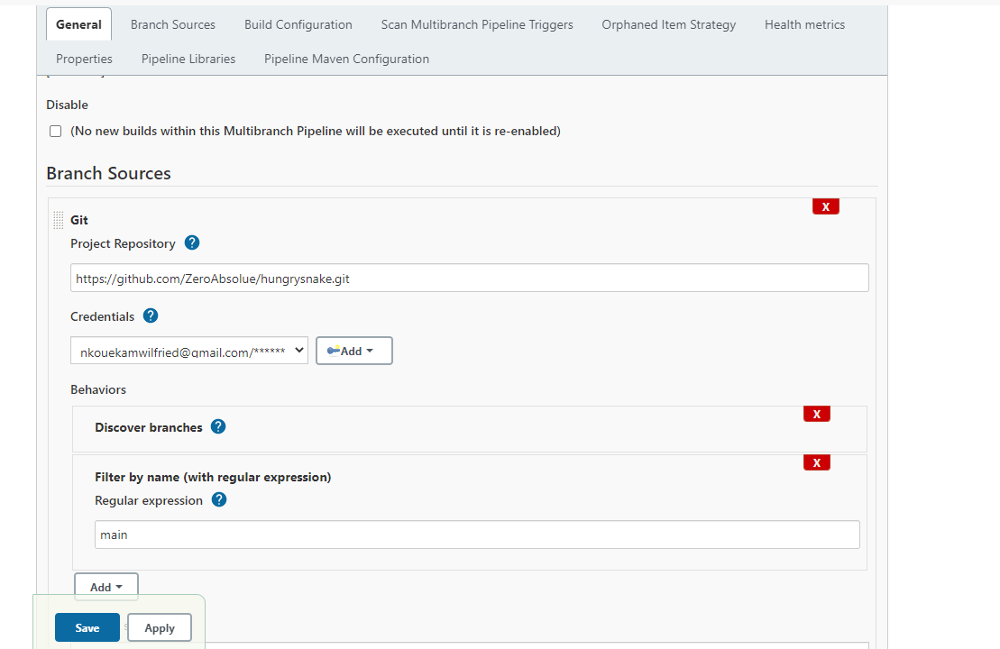
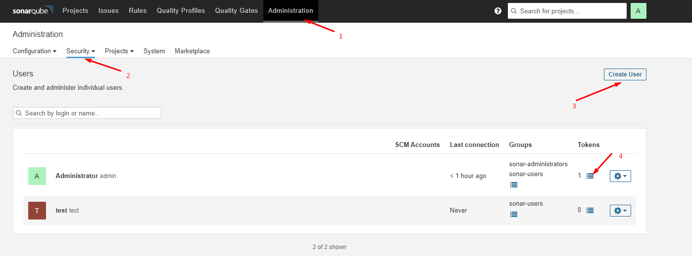

# Description du projet

Une longue créature serpentine se faufile dans un champ limité, obéissant aux ordres du joueur (déplacement à droite, à gauche, en bas et en haut). Et il n'y a aucun moyen de l'empêcher de bouger. Mais ne touchez pas les limites ou vous mourrez ! Et ne vous mordez pas ou... bon, vous voyez le genre. En cours de route, la créature rencontre de la nourriture qui l'allonge encore plus. Au fur et à mesure qu'elle grandit, elle est de plus en plus à l'étroit... Arrêtez la folie !

Tiré de codegym (2021).Hungry Snake - CodeGym. repéré à https://codegym.cc/projects/games/com.codegym.games.snake

# Diagramme de classe


# Intégration continue avec jenkins - sonarqube

Un prérequis de ce travail a été d'avoir déjà docker installé sur notre machine.

## 1- Installer et deployer jenkins
Une fois que docker est lancé sur votre machine, executer la commande : 
```
docker run -p 8080:8080 -p 50000:50000 -v jenkins_home:/var/jenkins_home jenkins/jenkins:lts
```
Ceci créera automatiquement un volume docker "jenkins_home" sur la machine hôte. Les volumes Docker permettent de conserver leur contenu des informations qui ont été traité dans le conteneur même lorsque ce dernier est arrêté, redémarré ou supprimé. L'espace de travail dans le conteneur sera /var/jenkins_home. Toutes les données de Jenkins s'y trouveront, y compris les plugins et la configuration que nous ferons.

Pour se connecter a l'application de jenkins il faut aller dans le navigateur à l'adresse __localhost:8080__. À la premiere connexion on va vous demander de spécifier le mot de passe administrateur. Ce mot de passe a été généré et afficher sur votre invite de commande lors de l'installation de jenkins en invite de commande


Vous pouvez selectionner d'installer les plugings par défaut de jenkins
## 2- Créer les identifiants github_token 
Pour permettre à jenkins de pouvoir accéder au repository github nous allons génerer des tokens d'accès. Ces tokens d'accès seront configuré dans jenkins

Pour generer le token sur github aller sur, 
```
Settings > Developper settings > Personnal access tokens 
```
puis cliquer sur le bouton générer un nouveau token
Au niveau du scope, sélectionner repo. Nous voulons uniquement lire, nous ne ferions pas de modification dans le repo

## 3 - Créer et configurer un projet Jenkins
Pour créer un nouveau projet, cliquer sur __new job__, en ce qui concerne  le type le type de projet que nous choisirons de créer dans Jenkins, 
nous allons utiliser un __Multibranch Pipeline__ ceci dans le but de faciliter la configuration de ressources et surtout eviter d'avoir à écrire des scripts dans Jenkins.

En fait ce que nous allons faire ce sera d'ecrire un seul script dans un fichier nommé Jenkinsfile que nous allons conservé sur notre serveur de versionning. L'idée ici est que lorsque nous voulons effectuer certaines actions (test, build) dans jenkins que nous ayons un seul endroit pour modifier les scripts.

Au niveau de __branch sources__ cliquer sur __add sources__ et specifier __vos credentials github(token a la place du mot de passe)__ ainsi que le repository. Pour le credentials à la place du password spécifier le token créer sur github token


Nous allons configurer le projet afin que le build se fasse à partir d'un jenkinsfile


Vous pouvez suivre aussi ce tutoriel pour configurer les étapes précedentes
https://www.youtube.com/watch?v=pMO26j2OUME&list=PLy7NrYWoggjw_LIiDK1LXdNN82uYuuuiC&index=1&t=327s&ab_channel=TechWorldwithNana

## 4 - Installer Sonarqube et le plugin sonarqube scanner
### Installation de Sonarqube
Pour installer Sonarqube, nous allons utiliser un conteneur docker.
Comme SonarQube utilise un Elasticsearch intégré, assurez-vous que la configuration de votre hôte Docker est conforme aux exigences du mode de production d'Elasticsearch et à la configuration des descripteurs de fichiers. 
Si vous êtes sur une machine linux: executez ces commandes.
```
sysctl -w vm.max_map_count=262144
sysctl -w fs.file-max=65536
ulimit -n 65536
ulimit -u 4096
```
Ensuite nous allons crée les volumes permettant à notre conteneur de stocker ses informations:
```
docker volume create --name sonarqube_data
docker volume create --name sonarqube_logs
docker volume create --name sonarqube_extensions
```
Démarrer ensuite le conteneur SonarQube avec les volumes persistants attachés :
```
docker run -d -p 9000:9000 -v sonarqube_conf:/opt/sonarqube/conf -v sonarqube_extensions:/opt/sonarqube/extensions -v sonarqube_logs:/opt/sonarqube/logs -v sonarqube_data:/opt/sonarqube/data sonarqube
```
```
Nom d'utilisateur : admin
Mot de passe : admin
```
Une fois terminé pour vous connectez à sonarqube il faut lancer __localhost:9000__
Pour tout ce qui concerne l'installation de sonarqube, vous pouvez aussi suivre ce tutoriel
https://www.youtube.com/watch?v=ZAfMauwNFuQ&t=750s&ab_channel=Thetips4you

### Crée un token projet dans sonarqube
Lorsque votre interface sonarqube est lancée, cliquer sur __Administration__. Ensuite cliquer sur sécurity et créer un nouveau utilisateur. Une fois l'utilisateur crée, au niveau de tokens, créer un nouveau token et conserver le token. Le token sera utilisé pour configuré sonarqube scanner


### Installation du pluging sonarqube scanner
Dans jenkins aller sur __manage plugings__, puis __available plugins__, rechercher et installer le plugins SonarQube Scanner for jenkins

### Configuration de sonarqube scanner et de maven
### 1- Maven
Dans jenkins, aller dans manager jenkins puis sur global tool configuration. 
Au niveau de maven, cliquer sur __add maven__ puis au niveau de name: spécifier le nom que vous voulez donner à votre maven aisni que la version puis sur enregistrer.
Notez que le nom que vous allez donner à votre maven sera utiliser dans le jenkinsfile


### 2- Sonarqube
Dans jenkins, aller dans manager jenkins puis sur Configure system.
Dans la session SonarQube servers, __activer Environment variables__ et dans la partie _SonarQube installations_ spécifier le nom, l'url de connexion à sonarqube ainsi que les identifiants projets crées sur sonarqube et enregistré

 
## 5 - Configuration du jenkinsfile
Nous allons configuré jenkins afin qu'a chaque build activé, il compile, lance les tests et informe sonarqube pour qu'il analyse la qualité de code

Vue que jenkins et sonarqube sont sur deux conteneurs différents, il nous faut spécifier dans le jenkinsfile comment ils vont communiquer. En fait il est question de donner une sorte de canal qui permette à sonarqube d'analyser le code. Pour le faire nous avons besoin de l'adresse ip du conteneur de sonarqube.

Ainsi pour obtenir l'adresse que vous voyez dans notre jenkinsfile, il faut se connecter à notre machine ou serveur sur lequel est installé docker et executer la commande:
```
docker inspect -f '{{range.NetworkSettings.Networks}}{{.IPAddress}}{{end}}' sonarqube
```

.

Une fois tout ceci fait, nous lancons le build pour le projet hungrysnake dans jenkins et  nous avons le resultat suivant 


Celui ci aussi si nous avons configurer sonarqube

# Migration vers Github actions

L'avantage avec github actions est que nous avons rien à installer vue que notre repository est sur github et que github action est directement lié à github.

Tout ce nous allons faire est de configurer un fichier yaml qui se chargera de compiler et lancer les tests comme le faisait le fichier jenkinsfile précédent

Conformement aux exigences de github actions, le fichier de configuration est situé sous le repertoire
```
.github/workflows/
```


Ce que fait ce script est de détecter les push et pull request qui ont lieu sur la branche main.

À chaque détection elle va monter une sorte de conteneur conteneur une machine ubuntu sur laquel elle va cloner le projet, installé les dependances, faire le build et lancer les tests.

Alors ici nous avons un tout en un qui en cas de succès va nous notifier si le build est concluant ou non